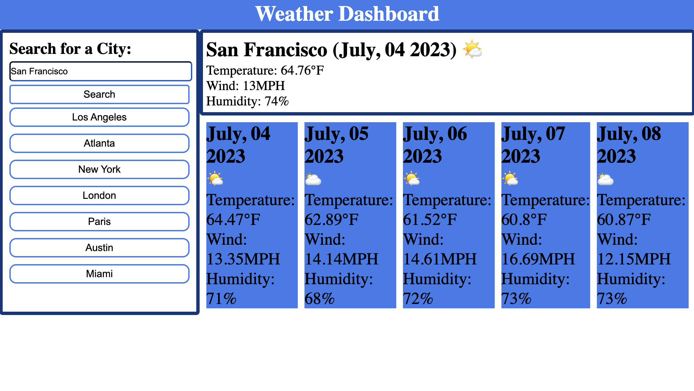

## Weather Dashboard

## Description
The Weather Dashboard is a web application that allows travelers to view the weather outlook for multiple cities. Users can search for a city and retrieve current and future weather conditions for that city. The application utilizes the OpenWeather API to retrieve weather data and stores user's search history using localStorage.
I learned to to call Weather Dashboard and use javascript to display the data into the HTML page.

## Features
Search for a city to view current and future weather conditions
Display city name, date, weather condition icon, temperature, humidity, and wind speed for the current weather
Display a 5-day forecast with date, weather condition icon, temperature, wind speed, and humidity
Click on a city in the search history to view its current and future weather conditions

## Technologies Used
HTML
CSS
JavaScript
OpenWeather API

## Usage
Visit the Weather Dashboard in your web browser.
Enter the name of a city in the search input field, will automatically display San Francisco when the page loads 
Click the search button or press Enter to retrieve the weather data.
View the current weather conditions and the 5-day forecast for the selected city.
To view weather conditions for a previously searched city, click on the city name in the search history.

## Installation
N/A 

[Website-link](https://carlosmb001.github.io/weather_website/)
## Credits
This project was developed by Carlos Martinez

[Emoji Unicode](https://emojiterra.com/)

The weather data is provided by the OpenWeather API.

Helped debugging help from my tutor Sachin